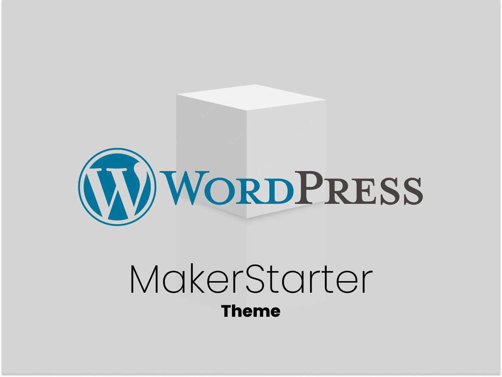

# MakerStarter



A WordPress 6.8+ full-site-editing theme and neutral design system. PHP 8.2+ is required.

The templates and header/footer use only WordPress core blocks, so the site shell remains usable without companion plugins. MakerBlocks patterns are optional examples; their saved markup is semantic and useful before React loads or when JavaScript is unavailable. MakerStarter does not install plugins, brand pages, or ship a frontend runtime.

## Site workspace

Treat `wp-content/themes/makerstarter/` as replaceable core. Put branding, composition, templates, template parts, patterns, assets, and project PHP in a sibling child theme at `wp-content/themes/<site>-theme/`. Its `style.css` uses the standard WordPress parent declaration:

```css
/*
Theme Name: Example Site
Template: makerstarter
*/
```

Do not edit or add a `custom/` directory to this checkout. Child overrides use standard WordPress resolution; MakerStarter does not discover project files. See [CORE-BOUNDARY.md](CORE-BOUNDARY.md) for ownership and compatibility policy.

## Git worktree workflow

The playground checkout is this repository's clean **primary worktree** and stays on `main`. For parallel core work, create a linked feature worktree outside WordPress:

```bash
git worktree add "$HOME/projects/worktrees/makerstarter/token-update" \
  -b feat/token-update
```

Develop, test, and commit in that linked worktree. Then merge from the playground primary worktree and remove the temporary checkout:

```bash
git switch main
git pull --ff-only
git merge feat/token-update
npm test
git worktree remove "$HOME/projects/worktrees/makerstarter/token-update"
git branch -d feat/token-update
```

A branch can be checked out in only one worktree. Use `git worktree list` to inspect active checkouts. Never use a feature worktree for site branding; that belongs in `<site>-theme`. Merge reviewed core changes to primary `main` before the Maker release flow.

## Stable design-token contract

MakerBlocks may consume these WordPress-generated CSS custom properties. Slugs are the public contract; values and style variations may change.

| Area | Slugs / variables |
| --- | --- |
| Color | `canvas`, `surface`, `ink`, `muted`, `accent`, `highlight`, `border` → `--wp--preset--color--{slug}` |
| Spacing | `20`, `30`, `40`, `50`, `60`, `70` → `--wp--preset--spacing--{slug}` |
| Type families | `sans`, `display` → `--wp--preset--font-family--{slug}` |
| Type sizes | `small`, `medium`, `large`, `x-large` → `--wp--preset--font-size--{slug}` |
| Radius | `small`, `medium`, `large`, `pill` → `--wp--custom--radius--{slug}` |
| Focus | `color`, `width`, `offset` → `--wp--custom--focus--{slug}` |
| Layout | `content`, `wide` → `--wp--custom--layout--{slug}`; canonical editor widths also remain at `settings.layout.contentSize` and `wideSize` |

MakerBlocks should include a sensible fallback in each `var()`, for example `var(--wp--custom--radius--medium, 1rem)`, so blocks remain portable to other themes. Do not couple block behavior to token values.

## Theme support

MakerStarter explicitly provides the textdomain, document titles, feeds, post thumbnails, editor styles, and the block-theme capabilities declared by `theme.json`. Compatibility notices are intentionally omitted: MakerBlocks and TypeRocket are optional, and the core shell needs neither.

## Structure

- `theme.json`: the token contract, fluid typography, spacing, and layout.
- `templates/`: core-only page and archive templates.
- `parts/`: core-only header and footer.
- `patterns/`: a core pattern plus optional MakerBlocks examples with semantic fallbacks.
- `styles/`: neutral global style variations that preserve token slugs.

## Project child themes

Do not customize this core checkout. DevArch renders the maintained `scaffolds/child-theme/` template into the sibling `themes/<site>-theme/` workspace and activates that child theme. Template tokens are creation-time inputs; existing destinations are never merged or overwritten.

Run `npm test` before packaging or publishing.
